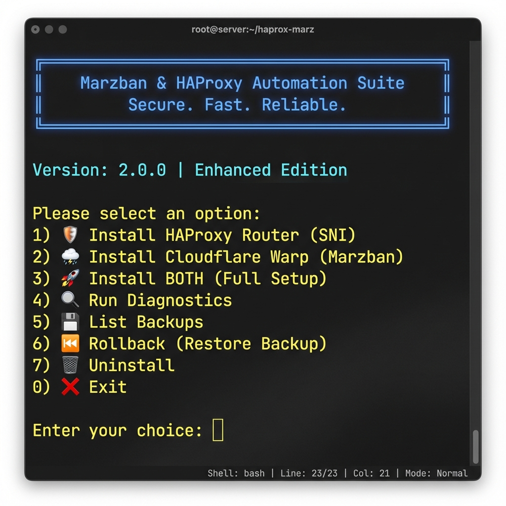

# 🚀 HAProxy & Marzban Automation Suite

**نسخه پیشرفته 2.0.0** - ابزار حرفه‌ای برای مدیریت چند دامنه روی یک پورت و پیکربندی Warp برای مرزبان

[](LICENSE)
[](https://github.com/tawanamohammadi/haprox-marz)

---

## 📖 فهرست مطالب

- [این ابزار چیست؟](#این-ابزار-چیست)
- [چه مشکلی را حل می‌کند؟](#چه-مشکلی-را-حل-میکند)
- [نصب سریع](#نصب-سریع)
- [راهنمای گام‌به‌گام](#راهنمای-گامبهگام)
- [سوالات متداول](#سوالات-متداول)
- [رفع مشکلات](#رفع-مشکلات)

---

## 🎯 این ابزار چیست؟

این ابزار **دو مشکل اصلی** سرورهای VPN را حل می‌کند:

### 1️⃣ مشکل: چند دامنه، یک پورت
**قبل از استفاده:**
- شما 6 سرویس دارید (پنل مرزبان، VLESS، VMess، Trojan، Hysteria، Reality)
- هر کدام روی پورت جداگانه‌ای کار می‌کنند
- باید 6 پورت مختلف را باز کنید
- مدیریت سخت است

**بعد از استفاده:**
- همه سرویس‌ها روی **یک پورت (443)** کار می‌کنند
- HAProxy بر اساس دامنه، ترافیک را هدایت می‌کند
- فقط یک پورت باز می‌شود
- مدیریت آسان است

**مثال:**
```
panel.example.com:443  → پنل مرزبان (پورت داخلی 8000)
vless.example.com:443  → VLESS (پورت داخلی 1001)
vmess.example.com:443  → VMess (پورت داخلی 1002)
```

**پیش‌نمایش ترمینال:**




### 2️⃣ مشکل: تحریم و فیلترینگ
**قبل از استفاده:**
- دسترسی به سایت‌های خارجی مشکل دارد
- برخی سرویس‌ها (ChatGPT، Netflix) کار نمی‌کنند
- IP سرور شما بلاک می‌شود

**بعد از استفاده:**
- Cloudflare Warp را به مرزبان متصل می‌کند
- ترافیک از طریق شبکه Cloudflare عبور می‌کند
- دسترسی به همه سرویس‌ها بدون محدودیت
- IP تمیز Cloudflare

---

## 💡 چه مشکلی را حل می‌کند؟

### سناریو 1: مدیر سرور VPN
**مشکل شما:**
- پنل مرزبان روی پورت 8000
- VLESS روی پورت 1001
- VMess روی پورت 1002
- Trojan روی پورت 1003
- باید همه این پورت‌ها را باز کنید و مدیریت کنید

**راه‌حل:**
```bash
sudo ./install.sh --haproxy
```
✅ همه سرویس‌ها روی پورت 443  
✅ مدیریت از یک نقطه  
✅ امنیت بیشتر  

### سناریو 2: کاربران شما به ChatGPT دسترسی ندارند
**مشکل شما:**
- کاربران نمی‌توانند از ChatGPT استفاده کنند
- Netflix کار نمی‌کند
- برخی سایت‌ها IP سرور شما را بلاک می‌کنند

**راه‌حل:**
```bash
sudo ./install.sh --warp
```
✅ اتصال به شبکه Cloudflare  
✅ دسترسی به همه سرویس‌ها  
✅ IP تمیز و قابل اعتماد  

---

## ⚡ نصب سریع

### پیش‌نیازها
قبل از شروع، مطمئن شوید:
- ✅ سرور Ubuntu 20.04+ یا Debian 11/12 دارید
- ✅ دسترسی root یا sudo دارید
- ✅ پورت 443 آزاد است (برای HAProxy)
- ✅ دامنه‌های خود را به IP سرور متصل کرده‌اید

### نصب با یک دستور
```bash
git clone https://github.com/tawanamohammadi/haprox-marz.git
cd haprox-marz
chmod +x install.sh
sudo ./install.sh
```

یا **نصب مستقیم:**
```bash
curl -fsSL https://raw.githubusercontent.com/tawanamohammadi/haprox-marz/main/install.sh | sudo bash
```

---

## 📚 راهنمای گام‌به‌گام

### قسمت اول: نصب HAProxy (مدیریت چند دامنه)

#### گام 1: اجرای نصب‌کننده
```bash
sudo ./install.sh
```

منوی زیر نمایش داده می‌شود:
```
╔═════════════════════════════════════════════════╗
║      Marzban & HAProxy Automation Suite         ║
║           Secure. Fast. Reliable.               ║
╚═════════════════════════════════════════════════╝

Please select an option:
1) 🛡️  Install HAProxy Router (SNI)
2) 🌩️  Install Cloudflare Warp (Marzban)
3) 🚀  Install BOTH (Full Setup)
4) 🔍  Run Diagnostics
5) 💾  List Backups
6) ⏮️  Rollback (Restore Backup)
7) 🗑️  Uninstall
0) ❌  Exit

Enter your choice:
```

#### گام 2: انتخاب گزینه 1 (HAProxy)
عدد `1` را وارد کنید و Enter بزنید.

#### گام 3: وارد کردن دامنه‌ها
اسکریپت از شما دامنه‌های زیر را می‌خواهد:

```bash
📥 Panel domain (e.g. panel.example.com): panel.yourdomain.com
📥 VLESS+WS domain: vless.yourdomain.com
📥 VMESS+TCP domain: vmess.yourdomain.com
📥 XHTTP domain (e.g. for Trojan): trojan.yourdomain.com
📥 Hysteria domain: hysteria.yourdomain.com
📥 Reality domain: reality.yourdomain.com
```

**نکته مهم:** این دامنه‌ها باید از قبل به IP سرور شما متصل شده باشند.

#### گام 4: وارد کردن پورت‌های داخلی
اسکریپت پورت‌های پیش‌فرض را پیشنهاد می‌دهد. اگر تغییری نمی‌خواهید، فقط Enter بزنید:

```bash
📍 Local port for panel [8000]: ← Enter بزنید
📍 Port for VLESS+WS [1001]: ← Enter بزنید
📍 Port for VMESS+TCP [1002]: ← Enter بزنید
📍 Port for XHTTP [1003]: ← Enter بزنید
📍 Port for Hysteria [1004]: ← Enter بزنید
📍 Port for Reality [1005]: ← Enter بزنید
```

#### گام 5: تایید نصب
اسکریپت:
- ✅ HAProxy را نصب می‌کند
- ✅ تنظیمات را ایجاد می‌کند
- ✅ سرویس را راه‌اندازی می‌کند
- ✅ خلاصه تنظیمات را نمایش می‌دهد

**خروجی نهایی:**
```
✅ HAProxy installation and configuration complete!
➡️  Config file: /etc/haproxy/haproxy.cfg
➡️  Status: systemctl status haproxy

📋 Configuration Summary:
  Panel:    panel.yourdomain.com -> 127.0.0.1:8000
  VLESS+WS: vless.yourdomain.com -> 127.0.0.1:1001
  VMESS+TCP: vmess.yourdomain.com -> 127.0.0.1:1002
  ...
```

#### گام 6: تنظیم سرویس‌های پشتی
حالا باید سرویس‌های خود (Xray، پنل مرزبان) را روی پورت‌های داخلی تنظیم کنید:

**مثال برای پنل مرزبان:**
```bash
# فایل docker-compose.yml را ویرایش کنید
ports:
  - "8000:8000"  # به جای 443:8000
```

**مثال برای Xray:**
```json
{
  "inbounds": [
    {
      "port": 1001,  // VLESS
      "protocol": "vless",
      ...
    }
  ]
}
```

---

### قسمت دوم: نصب Warp (دسترسی بدون محدودیت)

#### گام 1: اجرای نصب‌کننده
```bash
sudo ./install.sh
```

#### گام 2: انتخاب گزینه 2 (Warp)
عدد `2` را وارد کنید.

#### گام 3: انتخاب روش نصب
```
Choose setup method:
1) Xray core method (recommended)  ← این را انتخاب کنید
2) Wireguard kernel method

Enter your choice (1 or 2): 1
```

**توصیه:** گزینه 1 را انتخاب کنید (سازگاری بهتر با مرزبان).

#### گام 4: کلید Warp+ (اختیاری)
```
Do you have a Warp+ license key? (y/n): n
```

اگر کلید Warp+ دارید `y` بزنید، در غیر این صورت `n`.

#### گام 5: انتخاب ترافیک
```
Route ALL traffic through Warp? (y/n): n
```

**توصیه:** `n` بزنید تا فقط سایت‌های خاص (Google، ChatGPT، Netflix) از Warp استفاده کنند.

#### گام 6: ادغام خودکار با مرزبان
```
Do you want to automatically integrate Warp into Marzban config? (y/n): y
```

`y` بزنید تا اسکریپت به طور خودکار تنظیمات را به مرزبان اضافه کند.

#### گام 7: مسیر فایل تنظیمات مرزبان
```
Enter Marzban core config path [/var/lib/marzban/core.json]: ← Enter بزنید
```

اگر مرزبان را با Docker نصب کرده‌اید، فقط Enter بزنید.

#### گام 8: تایید نصب
اسکریپت:
- ✅ Warp را نصب می‌کند
- ✅ تنظیمات JSON ایجاد می‌کند
- ✅ به تنظیمات مرزبان اضافه می‌کند
- ✅ اعتبارسنجی JSON انجام می‌دهد

**خروجی نهایی:**
```
✅ Warp successfully integrated into Marzban!
⚠️  Please restart Marzban for changes to take effect:
   marzban restart
```

#### گام 9: راه‌اندازی مجدد مرزبان
```bash
marzban restart
```

یا اگر با Docker نصب کرده‌اید:
```bash
docker-compose restart
```

---

## 🎮 استفاده از CLI (برای کاربران پیشرفته)

### نصب سریع
```bash
# نصب فقط HAProxy
sudo ./install.sh --haproxy

# نصب فقط Warp
sudo ./install.sh --warp

# نصب هر دو
sudo ./install.sh --both
```

### عیب‌یابی
```bash
# بررسی وضعیت سیستم
sudo ./install.sh --diagnostics

# لیست نسخه‌های پشتیبان
sudo ./install.sh --list-backups

# بازگردانی به نسخه قبلی
sudo ./install.sh --rollback
```

### حذف
```bash
# حذف کامل
sudo ./install.sh --uninstall
```

---

## ❓ سوالات متداول

### 1. آیا باید هر دو قسمت را نصب کنم؟
**خیر.** بسته به نیاز خود:
- فقط مشکل چند پورت دارید؟ → فقط HAProxy نصب کنید
- فقط مشکل فیلترینگ دارید؟ → فقط Warp نصب کنید
- هر دو مشکل را دارید؟ → هر دو را نصب کنید

### 2. آیا مرزبان باید از قبل نصب باشد؟
**برای HAProxy:** خیر، می‌توانید ابتدا HAProxy را نصب کنید.  
**برای Warp:** بله، مرزبان باید نصب باشد.

### 3. دامنه‌ها را از کجا بگیرم؟
شما باید:
1. یک دامنه بخرید (مثلاً از Namecheap، Cloudflare)
2. زیردامنه‌ها بسازید (panel، vless، vmess، ...)
3. رکورد A را به IP سرور خود متصل کنید

### 4. آیا SSL/TLS نیاز است؟
**بله.** HAProxy فقط ترافیک را هدایت می‌کند. گواهی SSL باید روی سرویس‌های پشتی (Xray، پنل) نصب شود.

**راه‌حل آسان:** از Certbot استفاده کنید:
```bash
sudo apt install certbot
sudo certbot certonly --standalone -d panel.yourdomain.com
```

### 5. اگر اشتباهی کردم چه کنم؟
**نگران نباشید!** اسکریپت قبل از هر تغییری، نسخه پشتیبان می‌گیرد:
```bash
# بازگردانی به نسخه قبلی
sudo ./install.sh --rollback
```

### 6. چگونه بفهمم Warp کار می‌کند؟
```bash
# اجرای عیب‌یابی
sudo ./install.sh --diagnostics
```

یا از داخل سرور:
```bash
curl --interface warp https://cloudflare.com/cdn-cgi/trace
```

باید `warp=on` را ببینید.

### 7. چگونه تنظیمات را تغییر دهم؟
**برای HAProxy:**
```bash
sudo nano /etc/haproxy/haproxy.cfg
sudo systemctl restart haproxy
```

**برای Warp:**
```bash
sudo nano /var/lib/marzban/core.json
marzban restart
```

### 8. آیا با پنل‌های دیگر کار می‌کند؟
**HAProxy:** بله، با هر سرویسی که TLS دارد.  
**Warp:** فقط با مرزبان (یا Xray مستقیم).

---

## 🆘 رفع مشکلات

### مشکل 1: پورت 443 اشغال است
**علامت:**
```
[ERROR] Port 443 is already in use
```

**راه‌حل:**
```bash
# ببینید چه چیزی از پورت 443 استفاده می‌کند
sudo ss -tulnp | grep :443

# یا از عیب‌یابی استفاده کنید
sudo ./install.sh --diagnostics
```

معمولاً Nginx یا Apache است. آنها را متوقف کنید:
```bash
sudo systemctl stop nginx
sudo systemctl stop apache2
```

### مشکل 2: HAProxy شروع نمی‌شود
**بررسی لاگ‌ها:**
```bash
sudo journalctl -u haproxy -n 50
```

**اعتبارسنجی تنظیمات:**
```bash
sudo haproxy -c -f /etc/haproxy/haproxy.cfg
```

### مشکل 3: Warp به مرزبان اضافه نمی‌شود
**بررسی فایل JSON:**
```bash
# اعتبارسنجی JSON
jq empty /var/lib/marzban/core.json
```

اگر خطا داد، از نسخه پشتیبان استفاده کنید:
```bash
sudo ./install.sh --rollback
```

### مشکل 4: دامنه‌ها کار نمی‌کنند
**بررسی DNS:**
```bash
nslookup panel.yourdomain.com
```

باید IP سرور شما را نشان دهد.

**بررسی HAProxy:**
```bash
sudo systemctl status haproxy
```

### مشکل 5: Warp کار نمی‌کند
**بررسی اتصال:**
```bash
sudo ./install.sh --diagnostics
```

**بررسی لاگ‌های مرزبان:**
```bash
docker logs marzban -f
```

**راه‌اندازی مجدد:**
```bash
marzban restart
```

### مشکل 6: نمی‌دانم چه اتفاقی افتاده
**اجرای عیب‌یابی کامل:**
```bash
sudo ./install.sh --diagnostics
```

این به شما نشان می‌دهد:
- ✅ وضعیت سیستم
- ✅ پورت‌های باز/بسته
- ✅ وضعیت سرویس‌ها
- ✅ فایل‌های تنظیمات
- ✅ نسخه‌های پشتیبان

---

## 🔒 امنیت

### نکات امنیتی
1. ✅ همیشه از HTTPS استفاده کنید
2. ✅ گواهی‌های SSL را به‌روز نگه دارید
3. ✅ پورت‌های غیرضروری را ببندید
4. ✅ فایروال را فعال کنید
5. ✅ به‌طور منظم نسخه پشتیبان بگیرید

### فایروال
```bash
# اجازه فقط به پورت 443
sudo ufw allow 443/tcp
sudo ufw enable
```

---

## 📞 پشتیبانی

### گزارش مشکل
اگر مشکلی پیدا کردید:
1. ابتدا [سوالات متداول](#سوالات-متداول) را بخوانید
2. [رفع مشکلات](#رفع-مشکلات) را بررسی کنید
3. عیب‌یابی را اجرا کنید: `sudo ./install.sh --diagnostics`
4. در [GitHub Issues](https://github.com/tawanamohammadi/haprox-marz/issues) مشکل را گزارش دهید

### مستندات
- 📚 [مستندات کامل](https://tawanamohammadi.github.io/haprox-marz)
- 🇬🇧 [English Documentation](https://tawanamohammadi.github.io/haprox-marz)
- 📖 [راهنمای HAProxy](docs/haproxy.md)
- 📖 [راهنمای Warp](docs/warp.md)

---

## 📜 مجوز

این پروژه تحت [مجوز MIT](LICENSE) منتشر شده است.

---

## 🙏 تشکر

ساخته شده با ❤️ توسط [Tawana Mohammadi](https://github.com/tawanamohammadi)

اگر این ابزار به شما کمک کرد، لطفاً یک ⭐ به پروژه بدهید!
